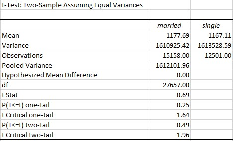
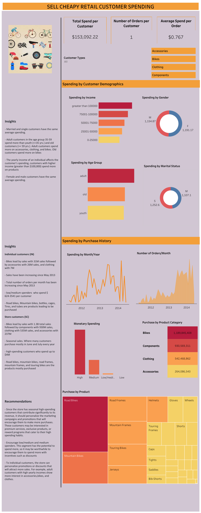

# Customer Spending 
Customer spending is the total money customers spend on goods and services for personal use. Customer spending can be compared based on time, location, age, income and others. For example, Youth spend more money on mobile phones than old people. In businesses, understanding spending patterns of your customers is very crusial. They help businesses to develop strategies for marketing, adapting to market changes, retaining customers, profit maximization and e.t.c
# Business Scenario
Sell Cheapy Retail is a chain of department stores that sells a wide range of products, including bikes and different components. Despite having a large customer base, the company has been struggling to increase sales in recent years. The management team is looking to use data analysis to understand customer spending patterns and make changes to their sales and marketing strategies to improve performance. The company collected data on customer demographics, purchasing history, and other relevant information over the course of a year. The data includes information on the products purchased, the price paid, and the date of purchase, etc.

## Business problem
The company is having difficulties to increase sales

## Project goal
To give insights on customer spending and recommend actions to be taken to increase sales

## Data collection
Data was collected from Sell Cheapy Retail database using Microsoft SQL Server management studio and stored in table views of the database.
You can access the data [here](https://techcommunity.microsoft.com/t5/educator-developer-blog/data-analysis-challenge-analyze-customer-spending-pattern/ba-p/3719590?WT.mc_id=academic-86947-ooyinbooke)
* [Customer spending SQL script](customer_spending_script.sql)
* The SQL script shows how you can access database metadata, Table selection, Duplicate checking, and Creating views

## Extraction, Transform, and Load (ETL)
Power BI is the tool used to to perform ETL, data modeling, analysis and visualization

Extracted 8 table views from database and Transformed them. Some of the activities in data transformation includes Renaming of columns, replacing values, re-ordering columns, merging queries, removing columns and rows, and changing data types.
Three (3) tables were loaded into data model.
## Data model
A star schema desing was built with addition of two tables, Wholesale value segmentation table and Calendar table
* Calendar table, wholesale table, measures and calculated columns were added in the model.
* Measures added were Total Purchases and Average order value
* Wholesale value segmentation table was added purposely to segment wholesale customers by average customer value. Four segments were used High, medium, low-medium, and low
* Calculated columns 'Age' and 'Age groups' were added. Three age groups were used; Old with > 59 yrs, Adult with > 35 yrs and youth with <= 35 yrs

## Analysis and Visualization
The analysis was done to understand retail customers spending patterns and wholesale customers spending patterns.

Iteract with the report [here](https://app.powerbi.com/view?r=eyJrIjoiMDc3OWVmZWYtMjdmZi00YjM3LWI3NjMtNjA0YjU1ZjJlOGM5IiwidCI6Ijc5M2EyYzE5LTY4N2ItNGJmOS05ZTBlLWJkOTU3YmE3ZDgxMyJ9)

### Statistical tests
Average spending of customers basing on gender and marital status have very little difference. An independent sample t-test was taken to check if they are statistically different

#### Hypothesis, Spending by Gender 

Null hypothesis = There is no difference in average spending between male and female customers

Alternative hypothesis = There is difference in average spending between male and female

α = 0.05

The test found that there is no statistical difference in average spending between male and female customers, t(27657) = 1, p = 0.16

#### Hypothesis, Spending by Marital status 

Null hypothesis = There is no difference in average spending between married and single customers

Alternative hypothesis = There is difference in average spending between married and single

α = 0.05

The test found that there is no statistical difference in average spending between married and single customers, t(27657) = 0.69, p = 0.25

## Dashboard

#### You can interact with dashboard by clicking [here](https://public.tableau.com/views/Customerspending_16829639821940/SELLCHEAPYRETAILCUSTOMERSPENDING?:language=en-US&publish=yes&:display_count=n&:origin=viz_share_link&:device=desktop)

## Insights

1. Demographic
* Married and single customers have the same average spending. 
* Adult customers in the age group 35-59 spend more than youth (<=35 yrs.) and old customers (>= 59 yrs.). Adult customers spend more on accessories, clothing, and bikes. Old customers spend more on bikes
* The yearly income of an individual affects the customer’s spending, customers with higher income (greater than $100,000) spend more on products
* Female and male customers have the same average spending. 

2. Purchase history

Individual customers(IN) purchase history

* Bikes lead by sales with $ 31M of total sales followed by accessories with $ 26M sales, and clothing with $ 7M
* Sales have been increasing since May 2013 
* Total number of orders per month has been increasing since May 2013
* low/medium spenders  who spend $ 624-3541 per customer
* Road bikes, Mountain bikes, bottles, cages, Tires, and tubes are products leading to be purchased

Store customers(SC) purchase history

* Bikes lead by sales with 1.3B total sales followed by components with $ 930M sales, clothing with $ 535M sales, and accessories with $ 237M
* Seasonal sales. Where many customers purchase mostly in June and July every year
* High-spending customers who spend up to $4M 
* Road bikes, mountain bikes, road frames, mountain frames, and touring bikes are the products mostly purchased

## Recommendations
* Since the store has seasonal high-spending customers that contribute significantly to its revenue, it should personalize the marketing campaigns and promotions that will encourage them to make more purchases. These customers may be interested in premium services, exclusive products, or reward programs that cater to their high spending habits.
* Encourage low/medium and medium spenders. This segment has the potential to spend more, so it may be worthwhile to encourage them to spend more with incentives such as discounts
* To individual customers, the store can personalize promotions or discounts that will attract more sales. For example, adult customers with high income per year show more interest in accessories, bikes, and clothes.

