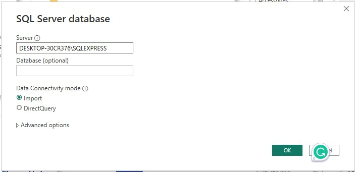
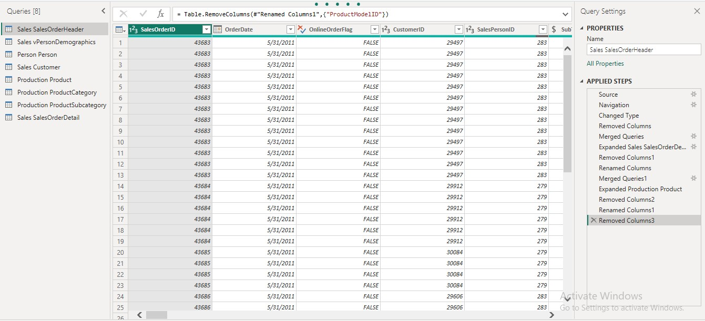
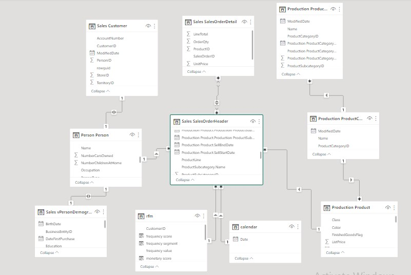
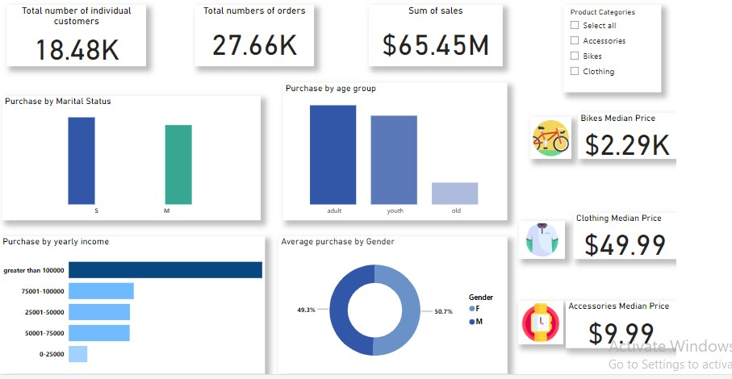

# Customer Spending Analysis
SellCheapy Retail is a chain of department stores that sells a wide range of products, including bikes and different components. Despite having a large customer base, the company has been struggling to increase sales in recent years. The management team is looking to use data analysis to understand customer spending patterns and make changes to their sales and marketing strategies to improve performance. The company collected data on customer demographics, purchasing history, and other relevant information over the course of a year. The data includes information on the products purchased, the price paid, and the date of purchase, etc.

# Business problem
The company is having difficulties to increase sales

# Project goal
To give insights on customer spending patterns and recommend actions to be taken to increase sales

# Data importation
The data is from AdventureWorks database. The AdventureWorks database supports standard online transaction processing scenarios for a fictitious bicycle manufacturer (Adventure Works Cycles). Scenarios include Manufacturing, Sales, Purchasing, Product Management, Contact Management, and Human Resources. 7 tables and 1 view were used from sales, people and product management scenarios. The tables are Sales.Customer, Sales.SalesOrderDetail, Sales.SalesOrderHeader, Person.Person, Sales.vPersonDemographics, Production.Product, Production.ProductCategory, Production.ProductSubcategory. 

Power BI was connected to SQL server database to access SellCheapy retail data.

# Data transformation
The imported data was transformed by power query before being loaded. 

In transformation, the common activities done are changing data types, removing columns that weren't used, merging queries, renaming columns, reordering columns, and filtering. 

# Data modeling
I used a star schema data model to organize data for easy understanding and analysis. Sales.SalesOrderHeader was a fact table.

# Analysis
The analysis was done in two segments, that is analysis based on demographic data of customers and analysis based on purchasing history of customers. 

### RFM analysis
RFM analysis was done using purchasing history data.
* Recency is the number of years since the last order was placed by a customer. The purpose was to understand customer relationship with the company and how many customers did the company lost or is at risk of losing which will decrease company sales
* Frequency is the total number of orders placed by a customer. The purpose was to understand how frequently orders are placed.
* Monetary is the sum of total due per order. The purpose was to understand customer spending per order. 

### Terms meaning
* TotalDue - total money a customer is paying. It includes tax, freight and subtotal
* List price - selling price of the product
* Accessories - additional products example helments and hydration packs 
* Components - bicycle components example chains and brakes
* Clothing - cloth materials for cyclist example gloves and jersey
* IN - individual customer
* SC - store customer, a wholesaler

# Visuals for Demographic Segments

# Visuals for Purchasing History

#### click [here](https://app.powerbi.com/view?r=eyJrIjoiMDE3NDcyMTEtM2Y5NC00OTkwLWFiMzgtYjBiNjdiMTMzZjlmIiwidCI6Ijc5M2EyYzE5LTY4N2ItNGJmOS05ZTBlLWJkOTU3YmE3ZDgxMyJ9) to interact with both visuals.

# Insights
### Purchase by demographic segments
* Customers with single marital status spend more than married customers. Single customers spend more on accessories and clothing while married customers spend more on bikes
* Adult customers in the age group 35-59 spend more than youth (<=35 yrs.) and old customers (>= 59 yrs.). adult and youth group customers spend more on accessories and clothing, and old customers spend more on bikes
* The yearly income of an individual affects the customer’s spending, customers with higher income (greater than $100,000) spend more on products
* Female customers spend 50.7% of total purchases than male customers who spend 49.3%. female customers spend more on accessories and clothing while male customers spend more on bikes

### Segments by purchase history
#### Individual customers
* Bikes lead by sales with 48.5% of total sales followed by clothing with 40.69%, and accessories with 10.81%
* Sales have increased from May 2013 to date
* Occasional high-spending customers who spend more than $ 3852 per order
* Frequently and infrequently low/medium customers who spend $ 104-807 per order
* In 2012, the company lost 227 individual customers while in 2013 the company is at risk of losing 7449 high-spending customers, 6409 low/medium spenders, and 6360 medium spenders 

#### Wholesale customers (store customers)
* Bikes lead by sales with 40.47% of total sales followed by components with 32.52%, clothing with 18.71%, and accessories with 8.3%
* Seasonal sales. Where many customers purchase mostly in June and July every year
* Frequently high-spending customers who spend between $45,503 and $ 3,057,639 per order
* Occasional high-spending customers who spend between $11,870 and $1,854,485 per order
* In 2012, the company lost 2,283 high-spending customers; in 2013 the company is at risk of losing 5,968 high-spending customers.

