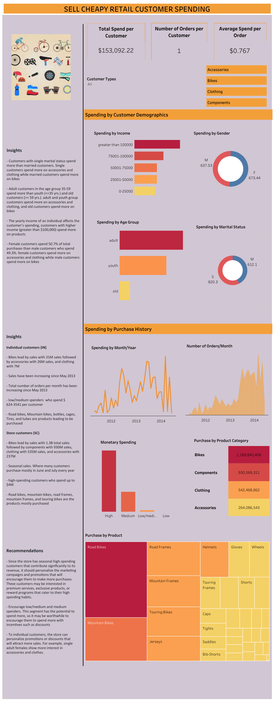

# Customer Spending Analysis
SellCheapy Retail is a chain of department stores that sells a wide range of products, including bikes and different components. Despite having a large customer base, the company has been struggling to increase sales in recent years. The management team is looking to use data analysis to understand customer spending patterns and make changes to their sales and marketing strategies to improve performance. The company collected data on customer demographics, purchasing history, and other relevant information over the course of a year. The data includes information on the products purchased, the price paid, and the date of purchase, etc.

## Business problem
The company is having difficulties to increase sales

## Project goal
To give insights on customer spending and recommend actions to be taken to increase sales

## Data preparation
* Data source is AdventureWorks database. The AdventureWorks database supports standard online transaction processing scenarios for a fictitious bicycle manufacturer (Adventure Works Cycles).
* Microsoft SQL Server management studio was the tool used to retrive data from database and perform data cleaning and transformation. 
* [Customer spending SQL script](customer_spending_script.sql)

* Tableau was the tool used to perform analysis to get trends and patterns and visualize insights.

## Analysis
The analysis was done in two segments, that is analysis based on demographic data of customers and analysis based on purchasing history of customers.

* Using demographic data, customer spending was analyzed based on their income, marital status, gender, and age group
* Using purchase history, customer spending was analyzed based on their total purchase made with time, products spending, and monetary spending

## Dashboard

#### You can interact with dashboard by clicking [here](https://public.tableau.com/views/Customerspending_16829639821940/SELLCHEAPYRETAILCUSTOMERSPENDING?:language=en-US&publish=yes&:display_count=n&:origin=viz_share_link&:device=desktop)

## Insights

1. Demographic
* Customers with single marital status spend more than married customers. Single customers spend more on accessories and clothing while married customers spend more on bikes
* Adult customers in the age group 35-59 spend more than youth (<=35 yrs.) and old customers (>= 59 yrs.). adult and youth group customers spend more on accessories and clothing, and old customers spend more on bikes
* The yearly income of an individual affects the customer’s spending, customers with higher income (greater than $100,000) spend more on products
* Female customers spend 50.7% of total purchases than male customers who spend 49.3%. female customers spend more on accessories and clothing while male customers spend more on bikes

2. Purchase history

Individual customers(IN) purchase history

* Bikes lead by sales with $ 31M of total sales followed by accessories with $ 26M sales, and clothing with $ 7M
* Sales have been increasing since May 2013 
* Total number of orders per month has been increasing since May 2013
* low/medium spenders  who spend $ 624-3541 per customer
* Road bikes, Mountain bikes, bottles, cages, Tires, and tubes are products leading to be purchased

Store customers(SC) purchase history

* Bikes lead by sales with 1.3B total sales followed by components with $ 930M sales, clothing with $ 535M sales, and accessories with $ 237M
* Seasonal sales. Where many customers purchase mostly in June and July every year
* High-spending customers who spend up to $4M 
* Road bikes, mountain bikes, road frames, mountain frames, and touring bikes are the products mostly purchased

## Recommendations
* Since the store has seasonal high-spending customers that contribute significantly to its revenue, it should personalize the marketing campaigns and promotions that will encourage them to make more purchases. These customers may be interested in premium services, exclusive products, or reward programs that cater to their high spending habits.
* Encourage low/medium and medium spenders. This segment has the potential to spend more, so it may be worthwhile to encourage them to spend more with incentives such as discounts
* To individual customers, the store can personalize promotions or discounts that will attract more sales. For example, single adult females show more interest in accessories and clothes.

