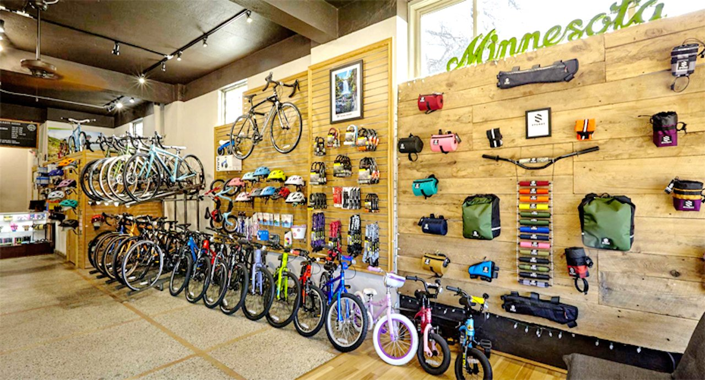
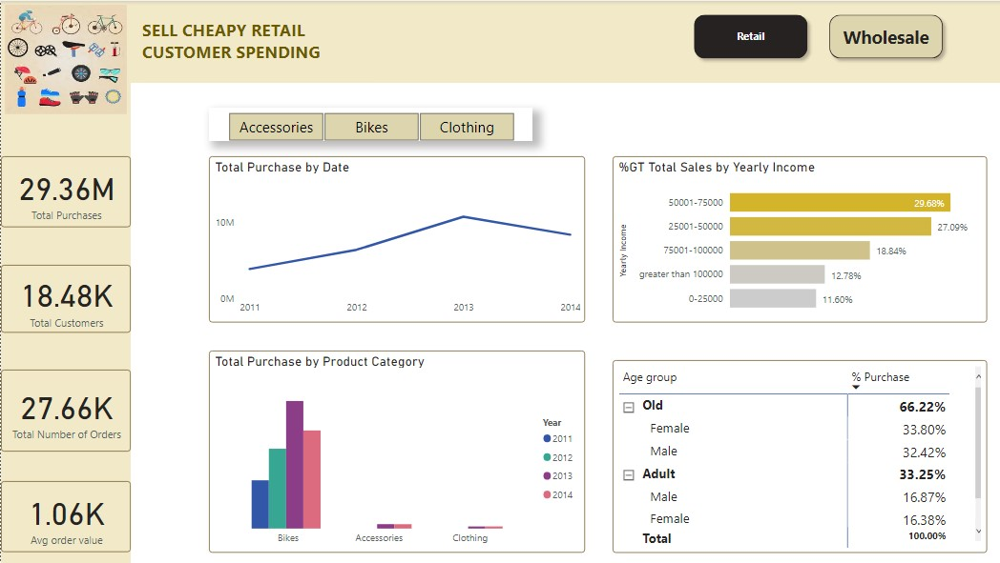
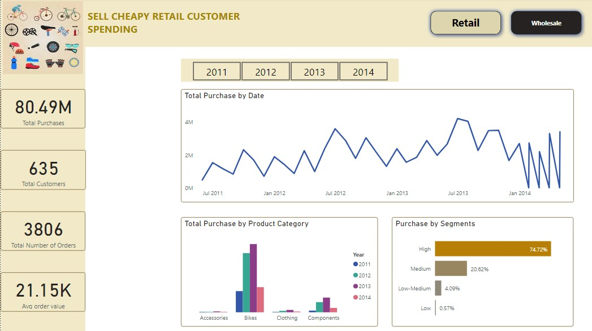
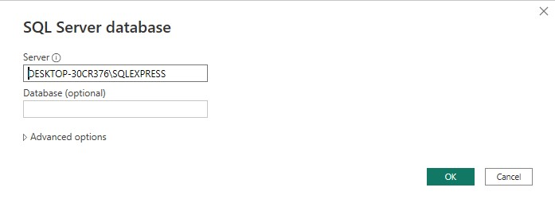
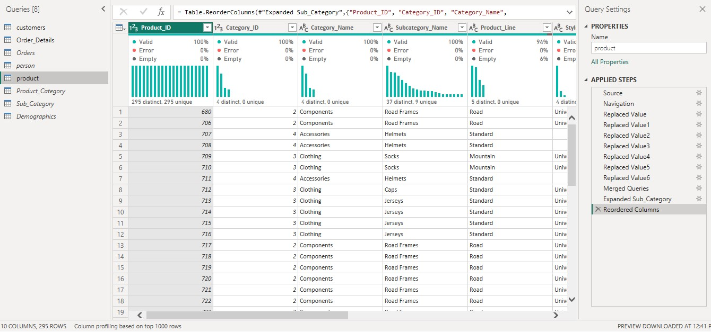
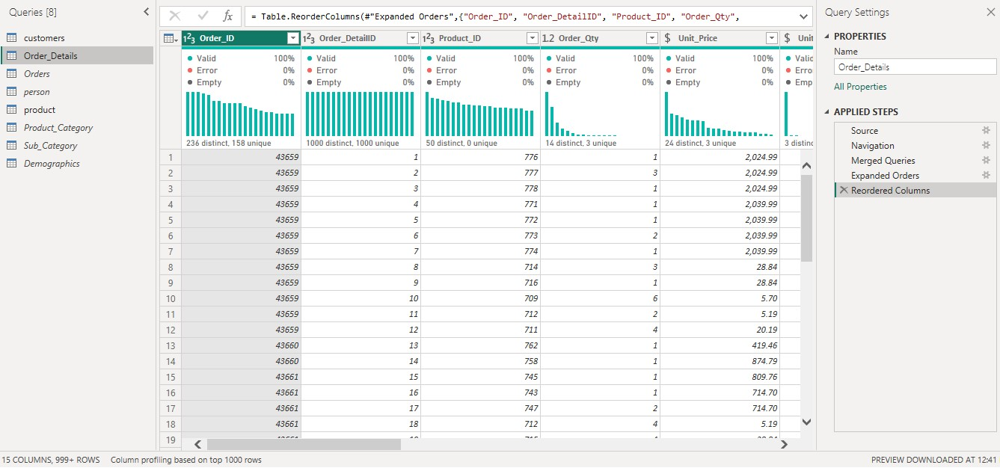
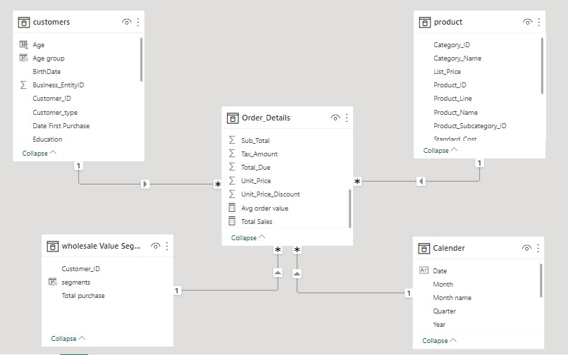
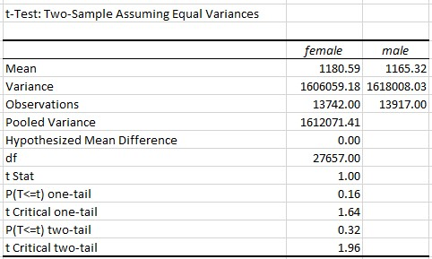

|_Courtesy of Tangletown Bike Shop_|
|---|
# Customer Spending 
Customer spending is the total money customers spend on goods and services for personal use. Customer spending can be compared based on time, location, age, income and others. For example, Youth spend more money on mobile phones than old people. In businesses, understanding spending patterns of your customers is very crusial. They help businesses to develop strategies for marketing, adapting to market changes, retaining customers, profit maximization and e.t.c

One thing to note is that consumer spending may not vary in the short term, for example, daily. Consumers might respond to changes in prices, incomes, or tastes to change their spending. This factors don't change daily and so consumers spending. Let's check a scenario on how to extract consumer spending patterns and use them to improve a business.

## Business Scenario
Sell Cheapy Retail is a chain of department stores that sells a wide range of products, including bikes and different components. Despite having a large customer base, the company has been struggling to increase sales in recent years. The management team is looking to use data analysis to understand customer spending patterns and make changes to their sales and marketing strategies to improve performance. The company collected data on customer demographics, purchasing history, and other relevant information over the course of a year. The data includes information on the products purchased, the price paid, and the date of purchase, etc.

## Business problem
The company is having difficulties to increase sales

## Project goal
To give insights on customer spending and recommend actions to be taken to increase sales

## Approach
The analysis was divided into two, Retail customer spending and Wholesale customer spending

**a) Retail Analysis**

Analyzed how customers spend based on their yearly income, Age groups, sex, product categories, and their spending history.
Three age groups were created; Old with years greater than 59, Adult with years greater than 35, and below 35 are youth group

|Retail Customers Spending Patterns|
|---|
||

#### Key Retail Insights
* Customer with high income per year (greater than 100,000) and those with the lowest income per year (0-25,000) they spend less in all product categories. Customers with high income per year spend 12.78% of the total purchase made while with low income spend 11.60%
* Spending in bikes has being increasing across the years while spending in accessories and clothing have not changed across the years
* Customers who are old spend more in all store products compared to adult and youth. 66.22% of the total purchases made are from customers who are old while Youth is 0.54% and Adult 33.25%

**Other Insights**
* Retail customers don't buy bicycle components from the store!, they purchase mostly bikes, clothing, and accessories
* Generally; May, March, April, and November are the months customers spend more compared to September, July, and June  
* Male and female have equal share of Total purchases made. Female have 50.46% of the total purchase and male have 49.54% of the total purchase 

**b) Wholesale analysis**

Analyzed their spending basing on products, purchase history, and customer value segments. Created four segments based on their total purchases; High spenders, medium, low-medium, and low spenders

|Wholesale Customers Spending Patterns|
|---|
||

#### Key Wholesale Insights
* Wholesale customers have seasonal spending with june and july being the months with high purchase across the years  
* The most demanded product are bikes, spending on bikes have being increasing across the years. Other products (components, clothing, and accessories) have very low demand.
* Most of the wholesale customers are High spending customers. 74.72% of the total purchase made are from High spending customers.

**Others**
* Wholesale customers purchase all product categories from the store (bikes, clothing, accessories, and components) compared to retail customers

## Recommendations
* Since the store has seasonal high-spending customers that contribute significantly to its revenue, it should personalize the marketing campaigns and promotions that will encourage them to make more purchases. These customers may be interested in premium services, exclusive products, or reward programs that cater to their high spending habits.
* Encourage medium spenders. This segment has the potential to spend more, so it may be worthwhile to encourage them to spend more with incentives such as discounts
* To retail customers, the store can personalize promotions or discounts that will attract more sales. For example, Adult and Youth group customers.
* Further analysis should be done on cross selling which can boost the purchase of accessories, clothing products, and bike components

## Data collection
Data was collected from Sell Cheapy Retail database using Microsoft SQL Server management studio and stored in table views of the database.
You can access the data [here](https://techcommunity.microsoft.com/t5/educator-developer-blog/data-analysis-challenge-analyze-customer-spending-pattern/ba-p/3719590?WT.mc_id=academic-86947-ooyinbooke)
* [Data collection SQL script](customer_spending_script.sql)
* The SQL script shows how you can access database metadata, Table selection, Duplicate checking, and Creating views

## Extraction, Transform, and Load (ETL)
Power BI is the tool used to perform ETL, data modeling, analysis and visualization.

|Database connection|
|---|
||

Extracted 8 table views from database and Transformed them. Some of the activities in data transformation includes Renaming of columns, replacing values, re-ordering columns, merging queries, removing columns and rows, and changing data types.

Three (3) tables were loaded into data model.

|Customer table|
|---|
||

|Product table|
|---|
||

|Order details table|
|---|
||

## Data Model
A star schema desing was built with addition of two tables, Wholesale value segmentation table and Calendar table

|Star Schema model|
|---|
||

* Calendar table, wholesale table, measures and calculated columns were added in the model.
* Measures added were Total Purchases and Average order value
* Wholesale value segmentation table was added purposely to segment wholesale customers by average customer value. Four segments were introduced High, medium, low-medium, and low
* Calculated columns 'Age' and 'Age groups' were added. Three age groups were introduced; Old with > 59 yrs, Adult with > 35 yrs and youth with <= 35 yrs

### Statistical tests
Average spending of customers basing on gender have very little difference. An independent sample t-test was taken to check if they are statistically different

#### Hypothesis, Spending by Gender 
* Null hypothesis = There is no difference in average spending between male and female customers
* Alternative hypothesis = There is difference in average spending between male and female
* α = 0.05

The test found that there is no statistical difference in average spending between male and female customers, t(27657) = 1, p = 0.16

