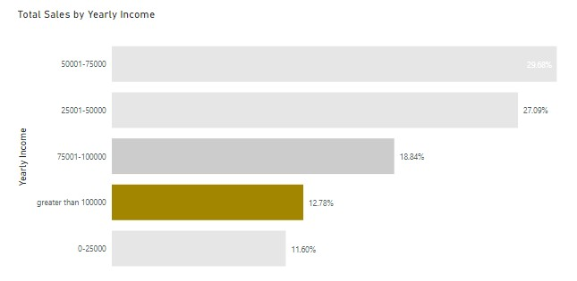
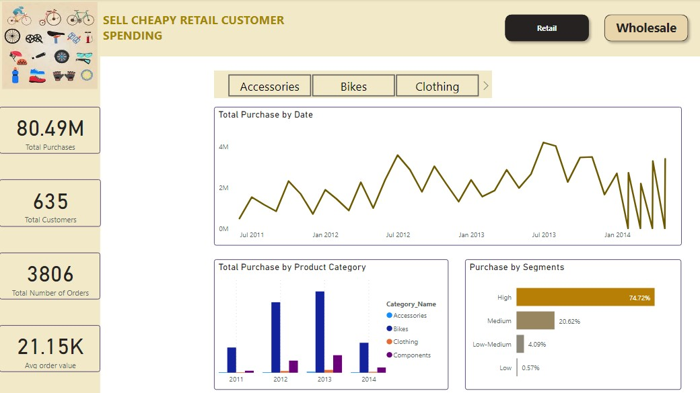
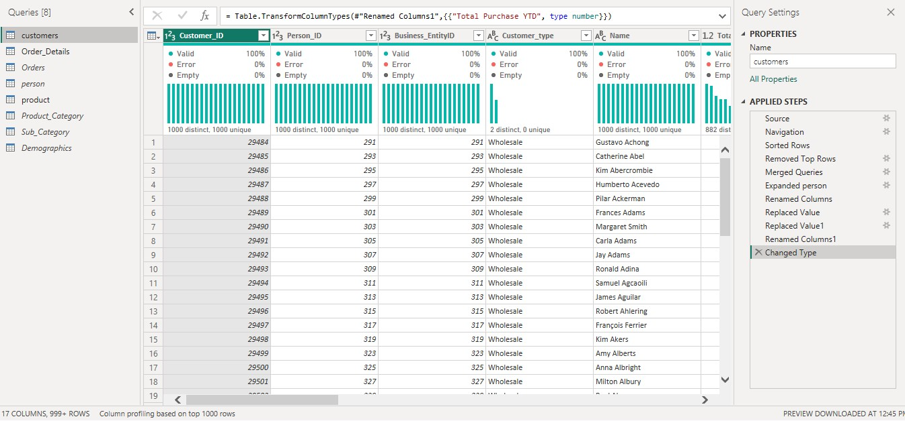

|_Courtesy of Tangletown Bike Shop_|
|---|
# Customer Spending 

## Business Scenario
Sell Cheapy Retail is a chain of department stores that sells a wide range of products, including bikes and different components. Despite having a large customer base, the company has been struggling to increase sales in recent years. The management team is looking to use data analysis to understand customer spending patterns and make changes to their sales and marketing strategies to improve performance. The company collected data on customer demographics, purchasing history, and other relevant information over the course of a year. The data includes information on the products purchased, the price paid, and the date of purchase, etc.

## Business problem
The task was to uncover customer spending patterns and recommend actions to be taken to increase sales

## Approach
The analysis was divided into two, Retail customer spending and Wholesale customer spending

**1) Retail Customers**

Analyzed how retail customers spend based on their yearly income, Age groups, sex, product categories, and their spending history.
Three age groups were created; Old with years greater than 59, Adult with years greater than 35, and below 35 are youth group

**Key Findings**

a) Customers with old age spend more than other groups

Customers with age > 59(old) spend more on bikes compared to other age groups. We expected this group to be least spenders on bikes because of their age. 

*What do this customers (old age) have compared to other groups causing them to spend more?*

Statistically (0.05 > p), most of this customers have an average of 1 child at home compared to Adults who have NO child at home. So the bikes they buy are for the childrens at homes. This can be the cause for them to spend more compared to adults.

b) Customers with the highest income per year spend less

This group of customers have the potential to spend more on products because of their income. Because of limited data, a further research can be done to know the cause of this incident

**2) Wholesale Customers**

Analyzed their spending basing on products, purchase history, and customer value segments. Created four segments based on their total purchases; High spenders, medium, low-medium, and low spenders

**Key findings**

a) Seasonal spending pattern

Wholesale customers have seasonal spending with june and july being the months with high purchase across the years. 

## Recommendations
* Since the store has seasonal high-spending customers that contribute significantly to its revenue, it should personalize the marketing campaigns and promotions that will encourage them to make more purchases. These customers may be interested in premium services, exclusive products, or reward programs that cater to their high spending habits.
* Customization. The store should modify products to suit the end users which are childrens at homes
* Further analysis should be done on customers with high income per year to harness their potential

#### Click the report image to interact 
|Retail Customers Spending Patterns|
|---|
||

#### Click the report image to interact 
|Wholesale Customers Spending Patterns|
|---|
||

**Other Insights**
* Spending in bikes has being increasing across the years while spending in accessories and clothing have not changed across the years
* Retail customers don't buy bicycle components from the store!, they purchase mostly bikes, clothing, and accessories
* Most of the wholesale customers are High spending customers. 74.72% of the total purchase made are from High spending customers.
* Wholesale customers purchase all product categories from the store (bikes, clothing, accessories, and components) compared to retail customers

## Data collection
Data was collected from Sell Cheapy Retail database using Microsoft SQL Server management studio and stored in table views of the database.
You can access the data [here](https://techcommunity.microsoft.com/t5/educator-developer-blog/data-analysis-challenge-analyze-customer-spending-pattern/ba-p/3719590?WT.mc_id=academic-86947-ooyinbooke)
* [Data collection SQL script](customer_spending_script.sql)
* The SQL script shows how you can access database metadata, Table selection, Duplicate checking, and Creating views

## Extraction, Transform, and Load (ETL)
Power BI is the tool used to perform ETL, data modeling, analysis and visualization.

|Database connection|
|---|
||

Extracted 8 table views from database and Transformed them. Some of the activities in data transformation includes Renaming of columns, replacing values, re-ordering columns, merging queries, removing columns and rows, and changing data types.

Three (3) tables were loaded into data model.

|Customer table|
|---|
||

|Product table|
|---|
||

|Order details table|
|---|
||

## Data Model
A star schema desing was built with addition of two tables, Wholesale value segmentation table and Calendar table

|Star Schema model|
|---|
||

* Calendar table, wholesale table, measures and calculated columns were added in the model.
* Measures added were Total Purchases and Average order value
* Wholesale value segmentation table was added purposely to segment wholesale customers by average customer value. Four segments were introduced High, medium, low-medium, and low
* Calculated columns 'Age' and 'Age groups' were added. Three age groups were introduced; Old with > 59 yrs, Adult with > 35 yrs and youth with <= 35 yrs

### Statistical tests
Average spending of customers basing on gender have very little difference. An independent sample t-test was taken to check if they are statistically different

#### Hypothesis, Spending by Gender 
* Null hypothesis = There is no difference in average spending between male and female customers
* Alternative hypothesis = There is difference in average spending between male and female
* α = 0.05

The test found that there is no statistical difference in average spending between male and female customers, t(27657) = 1, p = 0.16

